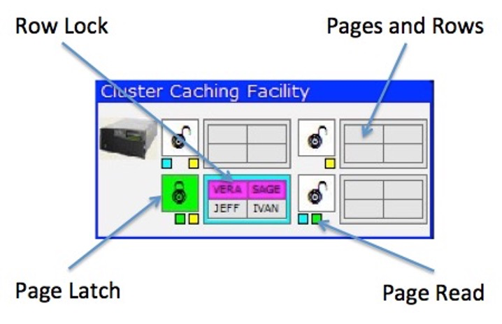

# pureScale Cluster Caching Facility

The pureScale Cluster Caching Facility, or CF, is used to control access to pages and locking across all the members. There can be up to two CFs in a pureScale system, but the simulator only uses one. You must configure a CF before the simulator will run. 

Aside from the pages and rows of data, the CF contains status information about the way the pureScale system is running. 

* Row locks 
* Pages currently in members buffers 
* Pages that are being updated 

## Row Locks
Whenever a client requests a lock on a row for update, the CF will highlight the row with the color of the client. In this example two rows are currently locked by client #1. When a commit or rollback occurs, the lock will be released, and the background color of the row will turn gray. 

## Page Read
When a page is read into the buffer of a member, the CF will turn on a small block under the page with the color of the member. For instance, the first page (top left) has two blocks on - blue and yellow. This means that both member 1 and member 3 have read the page into their buffers. This information is important to the CF since it needs to track who has a page in memory if the page needs to be invalidated because of an update. 

## Page Latch
A page latch is used to control updates to a page. A latch is not the same as a lock since it is not kept for the duration of an update. The latch is only in place to guarantee that the page gets updated properly before moving back to the CF and subsequently to another member. 
In the example, page 3 is currently in the process of being updated by member #2 (green). If another member needs to update this page, the CF will request this page back from member #2 (and makes sure that member #2 has finished updating any data on the page) before giving access to the other member. 