# Client Configuration

The main interface to running a simulation is through the client. Examining the client, you will see that there are several buttons and values in it. 

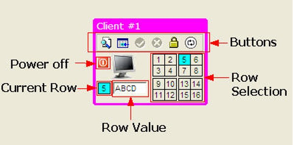 

There are five sections in the client: 

* Buttons - these control the execution of the simulation and client
* Row Selected - used for selecting one of sixteen rows to process 
* Power Off - used to kill a client to test error recovery 
* Current Row - the row that was selected or updated in a transaction 
* Row Value - the value of a row returned during a select, or the value that the row was updated to 

The buttons are the key component of the client since they control how the simulation runs. 

 

Some of these buttons may be grayed out depending on what the client is currently doing. However, the two buttons that are used to control the actual SQL that the client will run are always available. The buttons from left to right are: 

* Select - used to select a row from the table 
* Update - used to update the value of a particular row 
* Commit - only available when an update has been done 
* Rollback - only available when an update has been done 
* Locking mode - changes the locking behavior for a select only 
* Connect mode - determines how the client will connect 

Each one of these buttons is described in detail below. 

### Select Button
The Select button is used to select a row from the table. There are sixteen rows in the table and each one contains a first name. These names are randomly loaded into the Db2 table that resides on the IBM® Spectrum Scale file system. 

The client can only select one row at a time (no SELECT * ... available here!). To indicate which row you want to select, click on one of the sixteen row numbers found below the buttons. 

 

When you select a row, the square with the row number will turn blue, and the blue box below the monitor will be updated to contain the number. For instance, selecting row 5 with this client will result in the following display. 

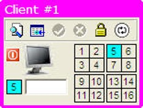 

Once a row has been selected, the SELECT button can be pressed and the simulation will start. If you do not have a valid configuration, an error message will be displayed beside the client. 

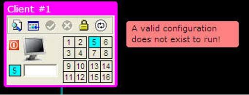 

Once the select transaction has completed, the row value in the client will be updated to contain the value of the row from the table. 

 
 
### Update Button
The update button is found beside the select button and works similarly. The client can only update one row during a "click" but many rows can be updated before a commit or rollback is done. In other words, the client could potentially update all 16 rows before requiring an update or a commit to occur. 

Selecting a row for update is identical to retrieving a row. You first need to select the row number and the box containing the row number will turn blue. Before issuing an update, you must place a value beside the row number box below the monitor. 

The following image shows the client replacing the value in row 5 with the value ABCD.
 
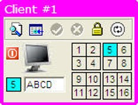 

You can also click on the row number box beside the row value to generate a random name. This is more convenient if you want to use the mouse to run the simulation rather than using the keyboard to enter a value. 

Once you've entered a value for the row you can press the update button. If you do not supply a value for the row, an error message will be generated. 

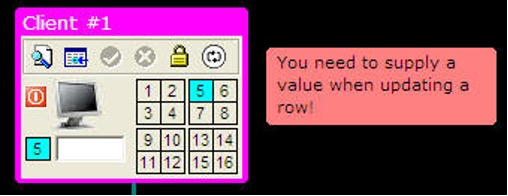 

Once an update has successfully completed, the row box in the grid will turn yellow to indicate that this row has been updated. 

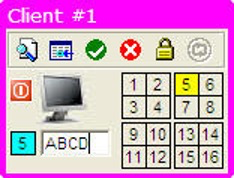 

The colors of the boxes will reset to gray when all updates are either committed or rolled back. 

### Commit and Rollback
The Commit and Rollback buttons are only available when you have successfully updated a row. Prior to this, the commit and rollback buttons are grayed out. 

 

Once we update a row, we will implicitly create a transaction. The implications of this are that any subsequent SELECT or UPDATE that is run from this client can only connect to the member that the original update went to. In other words, all transactions within this unit of work will have affinity (or be restricted to) to the member that the transaction started on.

 
 
Selecting the green arrow (Commit) will cause the updates to be committed on the CF and all locks released. Selecting the red "X" (Rollback) will cause the updates to be rolled back and no changes will have been placed into the table. 

### Locking Mode
The locking mode button lets you change how SELECTs (not UPDATES!) are handled by the member. By default, the client will request that currently committed semantics be used by the client. This will (in most cases) give the client the last properly committed value for a row. For instance, with the normal locking mode (closed lock) any select statement to a member will only read committed information. Normally if there are no locks on a row you would receive the current data that is in the local buffer pool or what is on disk. 

The image below shows that client #1 has retrieved the contents of row #1 (JEFF). 

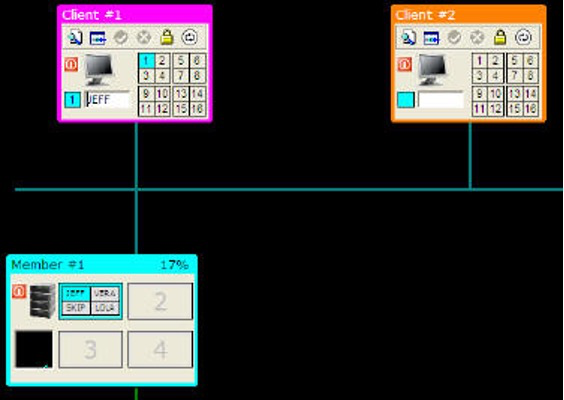 

The next image shows client #2 updating the value of row #1 to the value ABCD. 

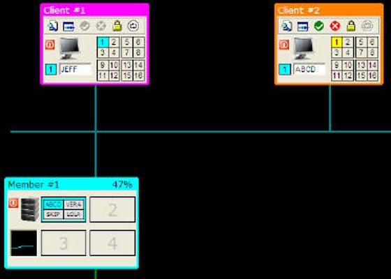 

The value in the buffer has changed to ABCD for row #1. Note also that the log file will now contain the original value of the row before the update. 

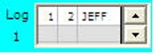 

When client #1 requests the row again, it will return the value of JEFF from the log file rather than the value from the buffer. The reason is that with currently committed semantics, we get the last known committed value of the row from the log, rather than the current "dirty" data in the buffer. Note that the row is not committed to disk or the CF until the client does a COMMIT. 

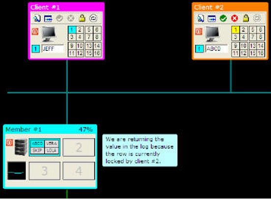 

If we want to get the value of the row currently in the buffer, we will change the locking mode to UR (Uncommitted Read). Clicking on the lock icon will change it to an open lock. 

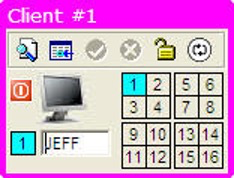 

Now issuing a SELECT statement will result in the current data on the page being returned to the client. 

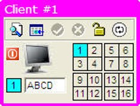 

Note that the client that initiated an update against a row will always see the current contents of the row, regardless of the locking model. Since the client did the update, they will always see the change that they made, rather than the previous, committed version. 

Clients that attempt to update a row that is currently locked on a different member will always wait for that update to complete. For read requests, the member will go to disk or the CF if the page is not in the current bufferpool. The reason for this is that a member cannot go "off" member to get the previous value of the row in the log.

For instance, the following image shows an updated row in member #1 (row 1 = TIFF) and member #2 requesting the same row via member #2. The client (#2) will have to wait for the update to complete before updating the contents of the row. 

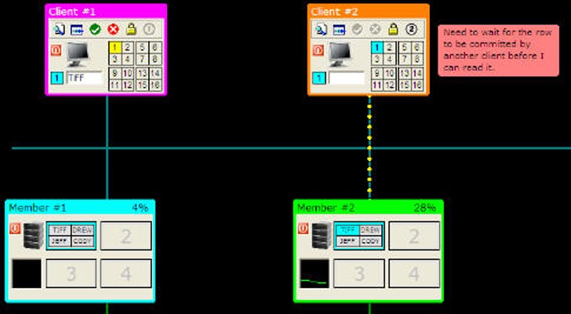 

If you use UR mode (uncommitted read), a client will read the contents of a row in the bufferpool even if it is locked.  

### Connection Type
For a select or update to take place, a connection must first be made to a Db2 member. In a pureScale system, a connection to a member is done when the client first connects; however, the connection can move to another member during subsequent CONNECT requests or at a transaction boundary. 

In the pureScale simulator, a new connection occurs whenever a SELECT takes place. The same is true when an UPDATE occurs, except that the client will NOT connect to a different member (for any subsequent SELECTs or UPDATEs) until a COMMIT or ROLLBACK occurs. The connection type box will turn gray when an UPDATE occurs, so all subsequent SELECTs and UPDATEs will continue to go to the same member. 

Whenever a transaction is started from a client, it will connect to one of the Db2 members that is available. Which member it connects to is based on the Connection Type icon found at the far right of the buttons at the top of the client. 

 

By default, the connection is set to workload balancing. The small graph icon represents CPU performance.

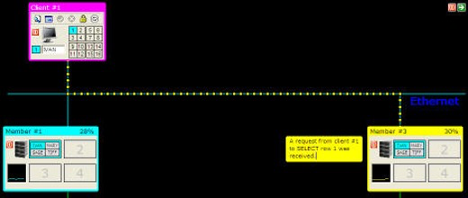 

When running with workload balancing, the connection will go to the least-used member. At the top of each member is the current load of the machine. 

 

The load of the member over time is shown as a small graph underneath the CPU image. 

 

When the client attempts a connection, it will look to see which the least-busy member is and connect there. The loads on the systems are random and change as the simulation runs.

If you want to set the load at a level (to guarantee you can show the client going to the least busy member), you can click on the graph in the member. This will display a grid with 4 CPU levels:

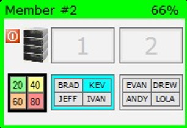 

When you click on 20, 40, 60, or 80, the CPU level of that member will be fixed at that amount.

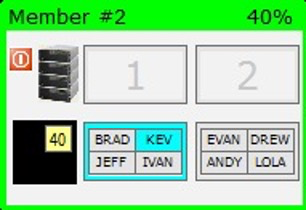 

The CPU level will remain at the level (40 in this example) until you click on the 40 again. The performance of the member will then begin to fluctuate as before.

Clicking on the connection button will make it change to round-robin mode. 

 

Round-robin mode means that at the start of any transaction the client will connect to the next available member. For instance, the first connection will always be to member 1. The second connection will be to member 2, and so on and eventually returning to member 1. If a member is not available, the connection will go to the next available member. 

The next three connection options are based on "affinity" or connection to a specific server. Clicking on the connection button will now change it from round-robin to connecting directly to members 1, 2, or 3 as shown in the following images.

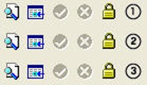 

When using affinity-based connections, the client will not be able to run transactions if their affinity server is not available.