# Client, Member, GPFS and CF Components

A pureScale system cannot run unless you have at least one client, one member, the IBM® Spectrum Scale file system, and one pureScale Cluster Caching Facility (referred to as the CF from now on). 

To create these objects, you will need to use the Objects toolbar found at the top left of the simulator program: 

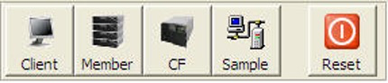

From left to right, these buttons represent the following objects. The first button is used for creating a client on the screen. 

 

When the client button is pressed, one client will be placed onto the simulator screen. The client will be connected to the network (Ethernet). 

 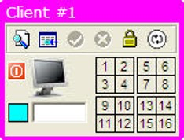

Up to three clients can be connected to the Ethernet and each one will have a unique number and color. The following image shows three clients on the screen. Client #1 is purple, client #2 is orange, and client #3 is red. 

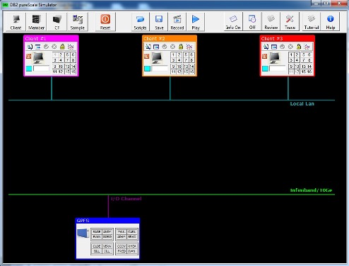

The client color will be used in the simulation to mark which client is holding an update lock on a row. The CF will be described later, but here is an example of the CF with locks being held by various clients: 

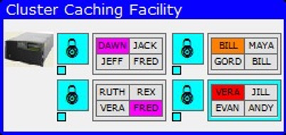
 
A pureScale system must have at least one member, so the member button is used to create a Db2 server (member) in the simulator. 

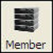

Pressing the member button will place a member on the screen, connected to both the Ethernet, for client communication, as well as the 10Ge network, for communicating with the CF. 

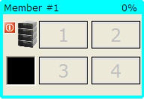 

In a similar fashion to the clients, each member has a unique number and color as shown in the following image. 

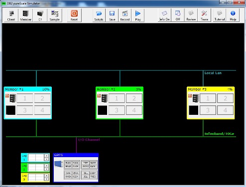 

Member #1 is light blue, member #2 is light green, and member #3 is yellow. These colors are used in the CF to highlight which member has read a page into its local buffer pool. In the CF, read "interest" in a page is marked by small squares below the lock icon. The color of the square indicates which member has read a particular page. 

 

In addition to creating a member on the screen, the member button will also create a log file associated with the member. This log file is placed to the left of the database file system to indicate that these files are found in the file system but are separate for each member. 

The following image shows three log files created for three members. A log file will only be created if the member exists. 

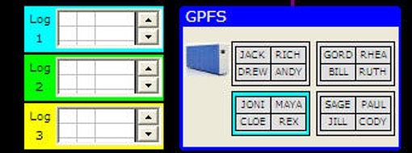 

The final object that can be created is the pureScale Cluster Caching Facility, or CF. 

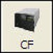 

Db2 pureScale uses the pureScale Cluster Caching Facility along with RDMA technology to deliver transparent application scalability. The CF provides centralized buffer pool and lock management facilities, which means that an application does not have to connect to the member where the data already resides. It is just as efficient for any member in the cluster to receive a data page from the global buffer pool regardless of the size of the cluster. 

The CF is placed on the bottom right-hand side of the screen. 

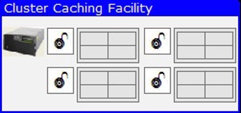 
 
Only one CF exists in the simulator, but a pureScale system can have both a primary and a secondary CF installed. For true high-availability operation, it is recommended that two CFs exist if one of them fails. 

A system can be built by adding clients, members, and CF. In fact, you can start with a simple configuration and add members or clients to increase the complexity of the system. Once you hit the maximum number of clients or members, the simulator will not allow you add any more. Note: Clients can be killed with the power off button that is found on them. You can then re-add the client later if you want. However, killing a Db2 member will cause an automatic recovery if there are any outstanding transactions on that member. If this is the case, the member will be restarted automatically. If there are no outstanding transactions, the member will be turned off. 

Stopping clients or members can only take place when any activity in the system (like a select or update) has completed. 

To quickly build a one client, one member system, click on the Sample button. 

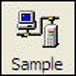 

This button will generate the following configuration. 

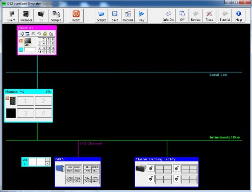 

If you want to delete your configuration, or start from the beginning, click on the Reset button. 

  

The reset button can be pressed at any time when using the pureScale simulator. If you are running your own script, a pre-built one, or in the middle of a recording, hitting the Reset button will stop all activity and create a clean configuration. Note that hitting reset will delete any recording that you may have done and destroy the configuration you had. 