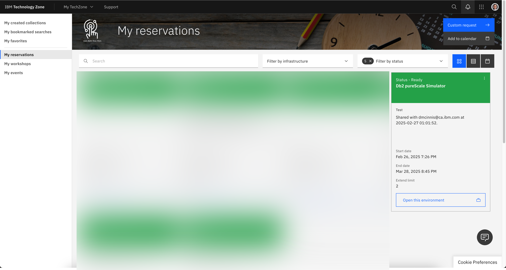
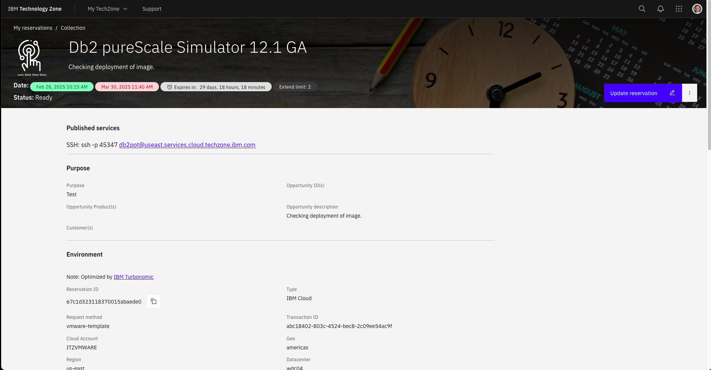
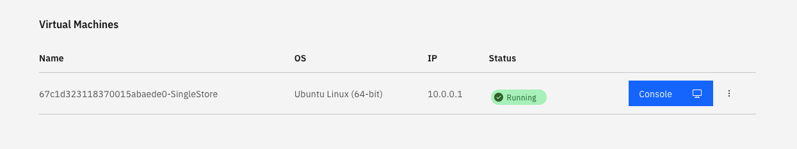
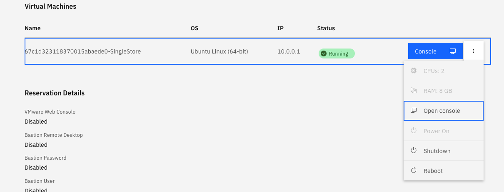
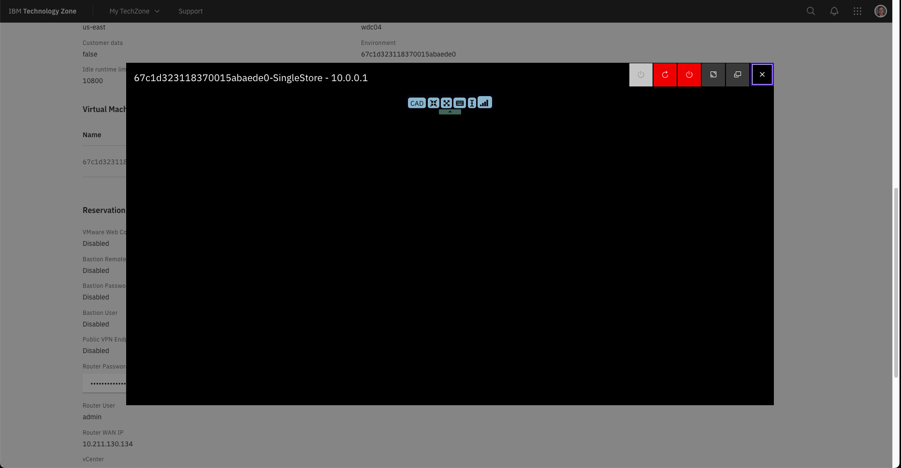
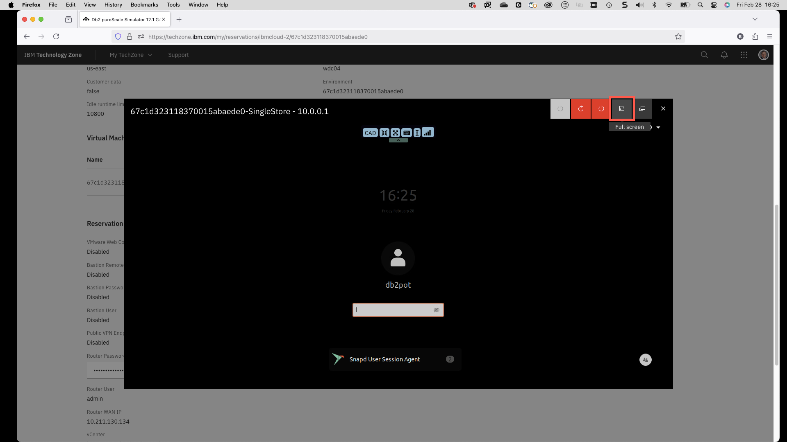
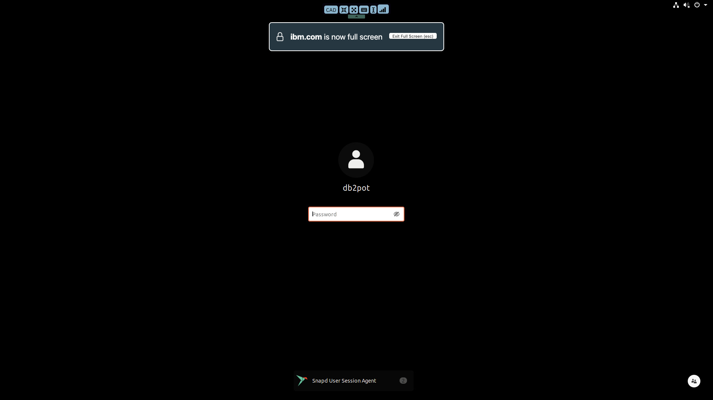
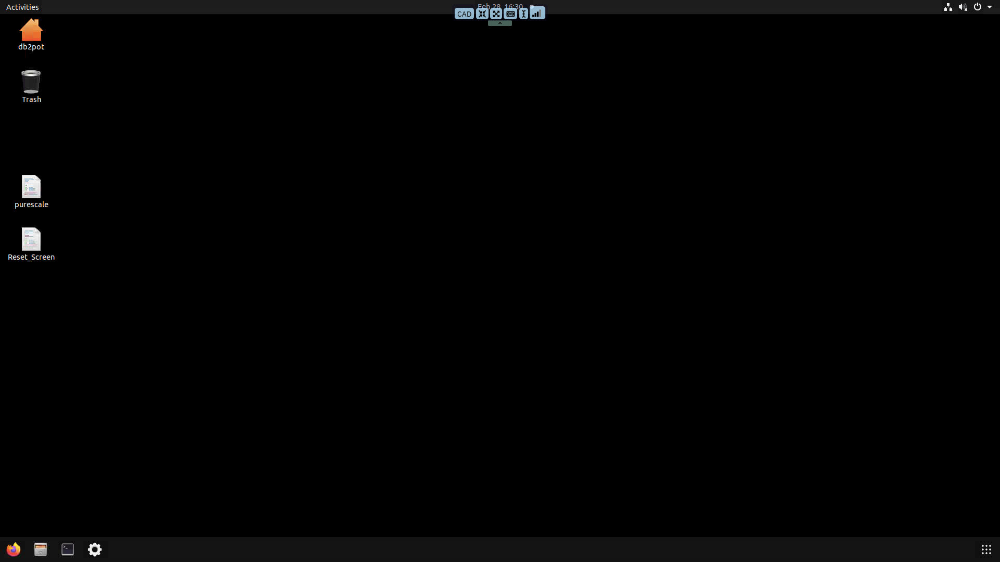
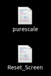

# Accessing the Simulator

You will be provided with either a link (workshop) or an email that provides access to the pureScale simulator system. For those reserving the pureScale simulator directly, your email will provide a link to your reservations.

Select your pureScale reservation from the list. 

The reservation contains the details about the virtual machine you are using.

The demonstration will use the console of the virtual machine. To access the console, you will need to scroll down the reservation details until you find the blue console button.

Beside the blue console button is a series of vertical dots which you will click to view additional console options.

Select the open console button. This will produce a small image of the virtual machine console on top of your reservation details.

At the top of the desktop image is a button that will maximize the console to use up your entire display.

Once you maximize the image, you will log into the system. The name of the user is `db2pot` and the password is `ilovepurecale`.

The desktop will display after you log on.

In order to make it easier to view the pureScale simulator, it is recommended to double-click on the Resize_Screen button. This will reset the screen to a smaller resolution.

Once you have resized the screen, double-click on the pureScale icon to start the simulator.

At this point you are ready to use the simulator!

!!! abstract "Removing the console toolbar"
    
    To remove the control bar at the top of the virtual console, click on the arrow at the bottom of the control bar. The control bar is not used during the pureScale demo and is only meant for resizing the screen or copying text into the image.