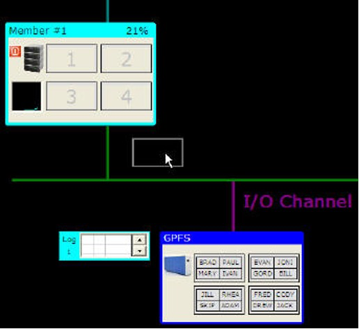
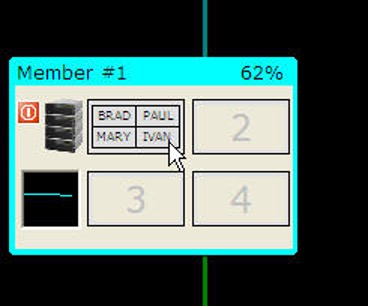

# IBM Spectrum Scale 
IBM® Spectrum Scale is installed as part of Db2 pureScale feature. IBM Spectrum Scale is the only supported file system in a Db2 pureScale environment and is used by Db2 to store the database, logs, and control files. 

The database is created for you whenever you start up the simulator, or if you reset the system. The database is immediately filled with 4-character names - a unique value for all sixteen rows found in the table. 

Every time that you reset or start the system, the names will change. If you run a simulation multiple times you will find that the data in the rows will change. 

If you want to change the names that are used by the simulator, you need to edit the file called `_gpfs.psc` found in the system directory. This file has a line like the following. 

```json
names = {GORD,BILL,JILL,CODY,...}
```

Replace the names with up to 32 different values, and the simulator will randomly select 16 names to fill the table with. 

Before you start running a simulation, you can drag pages from the file system to a member or the CF to pre-populate them with data. You can only move a page from the database to the same page slot in a member (or CF). For instance, page 1 from the database must move to page 1 of a member. You do not have to populate all the members or the CF with data, so it is possible to load up the CF with data without filling any buffer pages in the members. 

To move a page, click on a page in the CF and then while holding the LEFT mouse button down, drag the page to a member or CF. 

 

When you release the mouse over a page in a member or CF, the contents of that page will be updated with the data from the database.

 