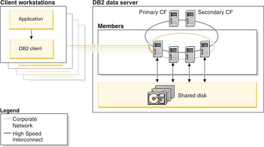

# Db2 pureScale Overview

The Db2 pureScale simulator allows a user to explore some of the concepts that are associated with a pureScale system. The user can define simple configurations and try selects and updates against members using a variety of connection and locking strategies. Member and clients can be turned off to show the effects of the outage on the configuration and the resulting recovery that pureScale will automate. 

While the simulator has been designed to show the concepts of running a Db2 pureScale system, it does not show all the possible system actions and communications between the clients, members, and cluster adapters. A production pureScale system will have many additional optimizations that will minimize much of the communication that you may see as part of the simulation. However, the high-level messaging is essentially the same, so you will get a sense of how the system works. 

## What is Db2 pureScale?
Db2 pureScale is a new optional Db2 feature that allows you to scale out your database on a set of servers in an “active-active” configuration delivering high levels of both availability and scalability. In this configuration, the copy of Db2 running on each host (or server) can simultaneously access the same data for both read and write. A collection of one or more Db2 servers that share Db2 data is called a data-sharing group. A Db2 server that belongs to a data-sharing group is a member of that group. All members of a data-sharing group share the same database. Currently, the maximum number of members in a data-sharing group is 128. In addition to the Db2 members, there is also the pureScale™ Cluster Caching Facility component which provides centralized lock management as well as a centralized global cache for data pages (known as the group buffer pool). 

Each member in the data sharing group can interact directly with the pureScale Cluster Caching Facility component, as shown below, through a very efficient 10Ge network which means each member has point-to-point connectivity to the centralized locking and caching facility. 

Db2 pureScale includes support for socket communication that eliminates the need for specialized 10Ge RDMA adapters. All the availability and recovery functions of pureScale are fully supported with sockets. However, the communication optimizations (i.e., memory to memory messaging with RDMA) are not applicable to socket configurations.
To reduce communication between nodes in the cluster for lock management and global caching services, Db2 pureScale uses the pureScale Cluster Caching Facility (here-in referred to simply as the CF) along with RDMA technology to deliver transparent application scalability. 

RDMA allows each member in the cluster to directly access memory in the CF and for the CF to directly access the memory of each member. For example, assume that a member in a cluster (Member 1) wants to read a data page that is not in its local buffer pool. Db2 assigns an agent (or thread) to perform this transaction; the agent then uses RDMA to directly write into the memory of the CF to indicate that it has interest in a page. If the page that Member 1 wants to read is already in the CF’s global centralized buffer pool, the CF will push that page directly into the memory of Member 1 instead of having the agent on that member perform the I/O operation to read it from disk. The use of RDMA allows Member 1's agent to simply make a memcopy (memory copy) call to a remote server without the need for costly process-to-process communication calls, processor interrupts, IP stack calls, and so on. Quite simply, pureScale allows a member’s agent to perform what appears to be a local memory copy operation when in fact the target is the memory address of a remote machine. 

These lightweight remote memory calls, along with a centralized buffer pool and lock management facilities, means that an application does not have to connect to the member where the data already resides. It is just as efficient for any member in the cluster to receive a data page from the global buffer pool regardless of the size of the cluster. Most RDMA calls are so fast that the Db2 process making the call does not need to yield the CPU while waiting for the response from the CF and does not have to be rescheduled to complete the task. For example, to notify the CF that a row is about to be updated (and therefore an X lock is required) a member’s agent performs a Set Lock State (SLS) request by writing the lock information directly into memory on the CF. The CF confirms that there are no other members in the cluster that already have this row X locked and will directly write into the requesting member’s memory to grant the lock. The entire round trip for this SLS can take as little as 15 microseconds and therefore the agent does not need to yield the CPU.
 
The agent can continue to be productive rather than waiting on an IP interrupt (avoiding unnecessary context switches) as is the case with other scale-out architectures. If for a specific operation, such as long-running batch transactions, it would make more sense for the Db2 agent to yield the CPU, Db2 will make an autonomic decision to dynamically yield the CPU.
 
Another important Db2 scalability feature that goes together with transparent application scaling includes the Db2 pureScale built-in load balancing across the members of a cluster. Applications do not need to be cluster-aware to take advantage of the load balancing. The same client-side drivers that Db2 for z/OS data sharing customers use today work with Db2 pureScale for cluster load balancing. 

Db2 pureScale takes availability to a new level when compared to other offerings available on distributed platforms. Db2 pureScale provides full access to every page of data that does not need recovery and is always aware of which specific pages need recovery without having to perform a single I/O operation. This is yet another important innovation made possible through the unique capabilities of a centralized CF. 

