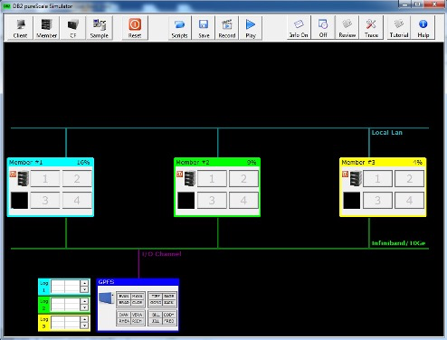
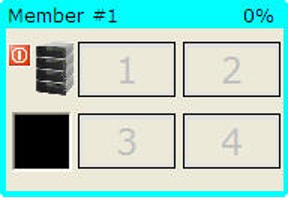

# Members

Db2 pureScale consists of members (Db2 Instances) that run on a physical machine or an LPAR. The simulator allows up to three members to be defined in the system. Each member has a unique number and color as shown in the following image. 

 

Member #1 is light blue, member #2 is light green, and member #3 is yellow. These colors are used in the CF to highlight which member has read a page into its local buffer pool. In the CF, read "interest" in a page is marked by small squares below the lock icon. The color of the square indicates which member has read the page. 

If a member has a page latch during an update statement, the lock symbol in the CF will change to the color of the member. For instance, if member #2 has a page latch on page 3, the CF will look like the following. 

The member contains a shutdown button that can be used to cause a hardware or software outage. 

If a member is currently involved in an UPDATE transaction, pressing the power off button will cause a recovery to occur. Any in-flight transactions will be rolled back, and the server will be restarted. 

If the member does not have any outstanding transactions, pressing the power off button will shut it down, like placing it in maintenance mode. If you want to remove a member from a configuration, make sure that there are no update transactions pending through that member. 