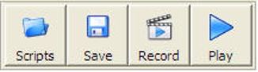
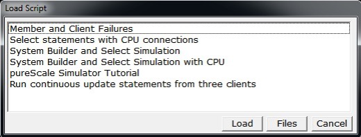
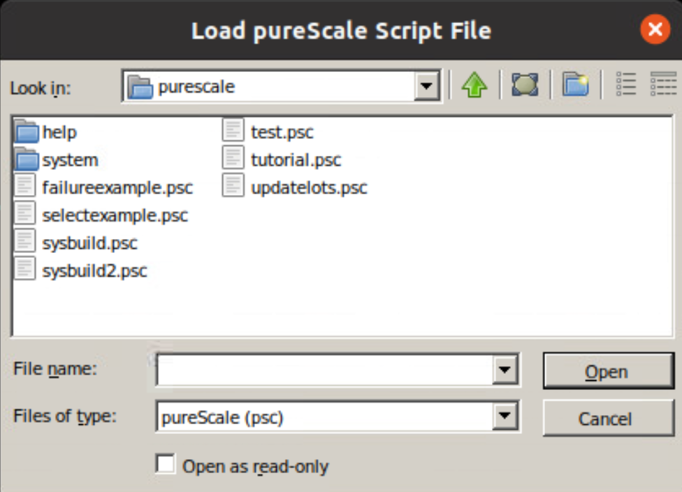
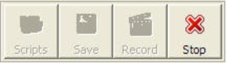

# Script Playback

The pureScale simulator comes with several "pre-built" simulations as well as the ability for you to create your own scenarios. The middle section of buttons at the top of the pureScale screen contains the playback and recording buttons. 

From left to right the buttons are: 

* Scripts - Pressing this button will give you the list of pre-defined scripts and any that you may have created. 
* Save - If you have done a recording session, pressing the Save button will let you store it for future use. 
* Record - Pressing Record will place the simulator into record mode where it will track every button that you click. 
* Play - When you load or record a script, pressing the Play button will play it back. 

## Loading Scripts and Playing Them
The Scripts button is used to load a pre-defined script into the simulator. 

When this button is pressed, the simulator will display a list of pre-defined and saved simulations. 

To load a file into the simulator, either double-click on the description of the simulation or select the description by clicking on it once and then hitting the load button. 
If you click on the FILES button, it will give you a list of the files in the directory that the program is running in. 

!!! note "File List Display"
    The file list may not match exactly that shown above due to differences in operating systems.

Select a file from the list and then click on the open button. Whichever technique you use, the file will be loaded into the simulator, but it will not begin running until you hit the play button. 

The play button will start the simulation that you loaded, and it will disable all the recording buttons and replace the play button with the stop button. 

You can press the STOP button at any time to terminate the simulation. Note that while the simulation is running, you will see the following two buttons on the far-right side of the screen. 

The section on running a simulation mentioned how clicking anywhere on the black network background would advance the simulation to the next step or message. The green button in this sidebar is used to make the simulation close the current message and move to the next step. 

Similarly, the red stop button is used to complete the current step - not stop the entire simulation. The stop button that is shown on the top menu bar is used to completely stop a simulation. A subsequent press of the PLAY button would start the simulation from the beginning. When you press this stop button, all it does is complete the current transaction (without animation or messages). So, for instance, if you were halfway through an UPDATE statement, the STOP button would complete the UPDATE (with all locking and buffer changes, etc...) so that the database is consistent. Then the next SELECT or UPDATE can take place. This is useful for skipping several steps that you don't want to see. However, remember that this is not the same as stopping the entire simulation. 