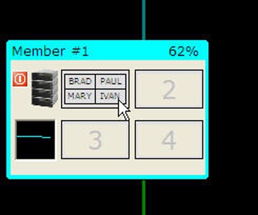

# Recording and Saving Scripts

If you want to record a scenario to demonstrate to others, you can do it with the record button. When the record button is pressed, any current configuration found on the screen is deleted and you are left with a blank configuration (except for the file system). The background will have the word RECORDING set in red. 

 

Once recording has been started, the buttons in the recording section will turn off, except for the STOP recording button. 

 

The following keystrokes will be recorded in this mode: 

* Create Client 
* Create Member 
* Create CF 
* Drop / Kill Client 
* Drop / Kill Member 
* Select Row 
* Update Row 
* Change locking mode, connection type 
* Pre-loading buffers 

The selects and updates that you run as part of the simulation will be captured (i.e., the actual workload that you run). Once you are done with the simulation you can press the STOP button and then either playback the simulation (with the PLAY button) or press the SAVE button to file your work. 

 

When you press the SAVE button, the simulator will first ask you to give a description of the simulation you just created. This is the same description that will be placed in the FILE menu when you request all the pre-defined and saved scripts on disk. 

 

After pressing SAVE, a file menu will be displayed where you will enter the filename that you want to assign to the simulation. 

 

By default, all simulator files have an extension of ".psc". There are some special files found in the /system directory that are used by the simulator to run the examples. These files all start with the underscore "_" and are not meant to be changed. Simulations that are saved are normally placed in the root directory where the simulator program is found. 

## Pre-Loading buffers
A handy shortcut is available that will let you pre-load the buffers of the members or CF before running any simulations. Before you start running your simulation, you can drag pages from the database to a member or the CF. You can only move a page from the database to the same page slot in a member (or CF). For instance, page 1 from the database must move to page 1 of a member. You do not have to populate all the members or the CF with data, so it is possible to load up the CF with data without filling any buffer pages in the members. 

To move a page, click on a page in the CF and then while holding the LEFT mouse button down, drag the page to a member or CF. 

 

When you release the mouse over a page in a member or CF, the contents of that page will be updated with the data from the database.

 
 
## Annotations
You can add annotations to your recorded script as you go along. To add an annotation, place the mouse at the location on the screen where you want a message placed and then right click. This will pop up a comment box that you can then enter your text. 

 

You can move the comment box anywhere on the screen by left-clicking on the title bar and holding down the mouse while you drag it to the location you want. 

Within the text box you can add any text that you want. When you are finished typing, hitting ENTER will save the comment. Then when your script is run, the comment will display for 4 seconds before continuing onto the next step. 

For instance, the text in the previous screen would look like this image. 

 

By default, the message will display for a few seconds before going to the next step in your simulation. You can add a button to the message to make it wait for the person to press before continuing. The following script adds a button to the annotation. 

 

When the script runs, the user will see the following. 

 

One final thing that you can add to an annotation is a title. A title will follow any button definitions and is separated from the message with a colon (`:`). 

```[OK]Test a button:Here is the text separate from the title```

When this is run, the user will see the following. 

 