# Reserving Db2 pureScale Simulator

The following section provides details on how to reserve an image of the Db2 pureScale simulator.

!!! note "Workshop Users"
    If you are part of a workshop, you do not have to request a reservation. Instead, go to the [Getting Started](ps-getting-started.md) section. 

## Requesting a TechZone image

Click on the following link to open the TechZone reservation portal for the pureScale simulator (<a href="https://ibm.biz/techzone-purescale" target="_blank">https://ibm.biz/techzone-purescale</a>). If this brings up the pureScale simulator reservation screen, skip to [Reservation Details](#reservation-details).

If this does not work, view the Db2 Modernization collection and select the Db2 pureScale simulator 
(<a href="https://techzone.ibm.com/collection/db2-modernization" target="_blank">https://techzone.ibm.com/collection/db2-modernization</a>).

If you have not logged into the IBM Cloud site, you will be asked to
authenticate with your IBM userid. 

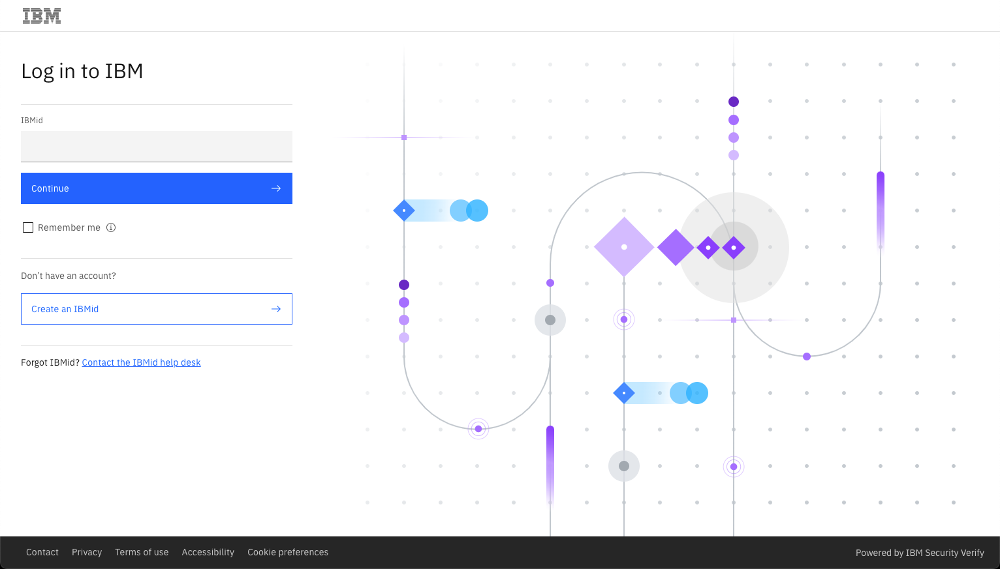

If you do not have an IBM userid, you will
need to register for one. This lab is open to IBMers and Business Partners. Once
you have logged in, you should see the following.

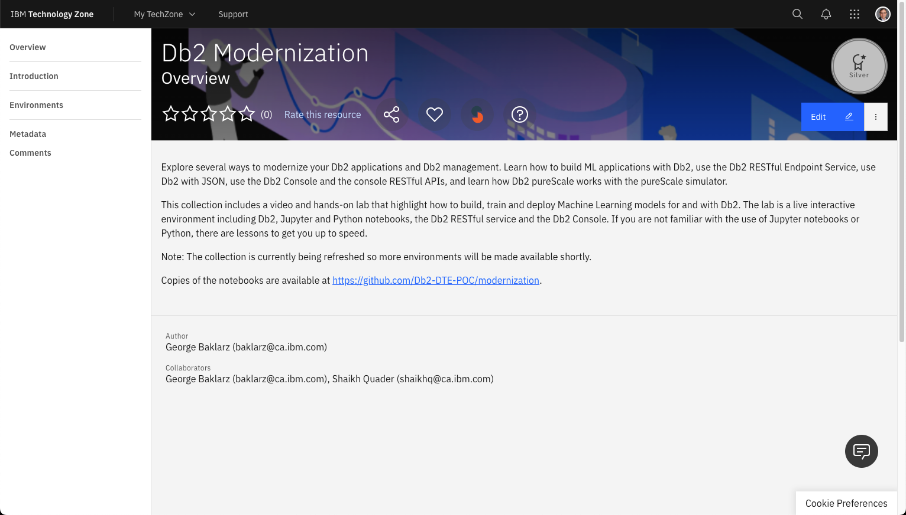
 
Select the Environment tab on the far-left side. 

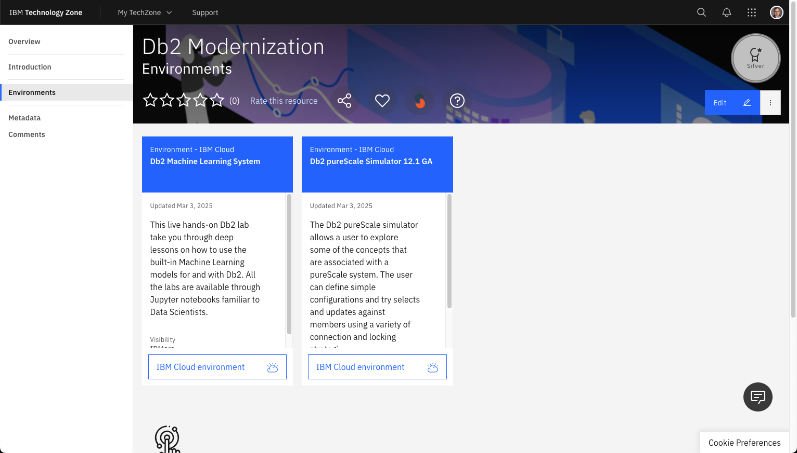

!!! note "Select the pureScale Simulator"
    There may be more than one environment available. Choose the pureScale simulator.

## Reservation Details

The initial question will ask if you want to reserve the system now or for a later date. Select "reserve now" (why wait?).

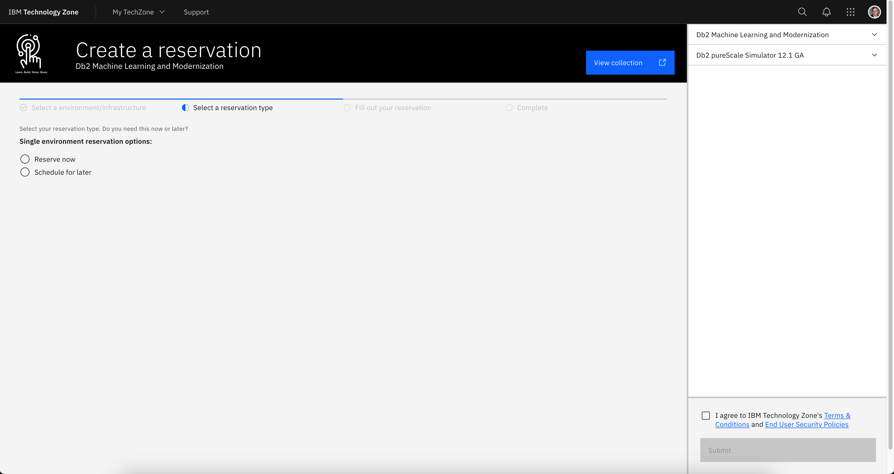 

The next screen will ask what the purpose of the reservation is. For "Purpose" select Education or Test. Either of these options will limit the amount of time that you will be able to use the system. 

A purpose description will be highlighted once you select the reservation type.

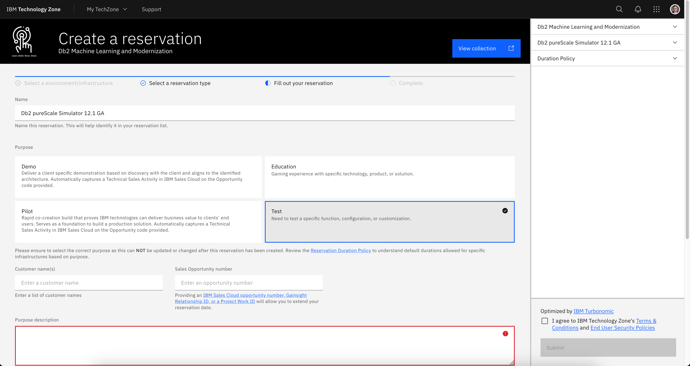

Fill in the purpose field with something meaningful (Db2 pureScale education). Next select the preferred Geography for the image.

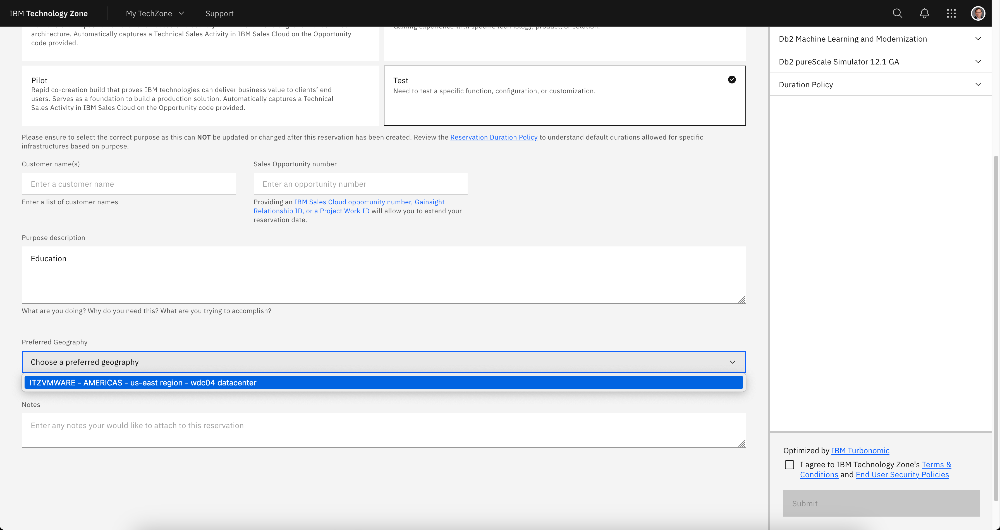

Choose any of the regions that are closest to your location. 

!!! note "Server Locations"
    The TechZone scheduler will pick a location in your region that has capacity to deploy your image. The available regions are constantly being updated, so your list of servers will be different from those shown in the image above,

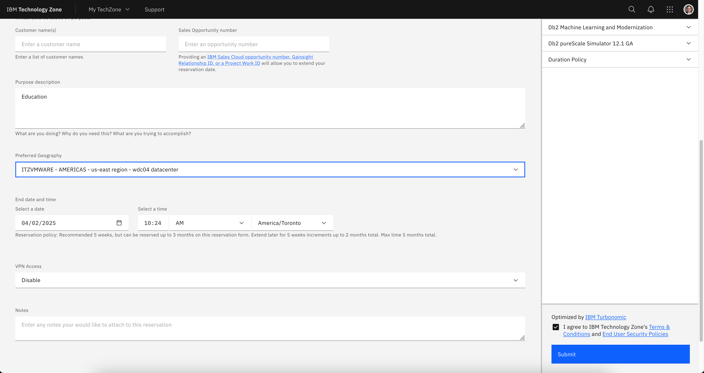 

Once the location has been set, the start and end dates are shown in the panel along with an agreement dialog (far right bottom of the display). Make sure you select enough time for you to use the lab! It defaults to 2 days, but you can extend the reservation.

!!! warning "VPN Access"
    You do not need to enable VPN Access! Make sure it remains **Disabled**!

You must accept the terms and conditions for the reservation in order to use TechZone. Once you are satisfied with the settings, press the Submit button.

!!! note "Reservation Failure"
    If you find that your reservation is not being provisioned, check the status of the TechZone environment by referring to the TechZone status page at <a href="https://techzone.status.io" target="_blank">https://techzone.status.io</a>.

At this point you will need to wait patiently for an email that acknowledges that your request has been placed into Provisioning mode.

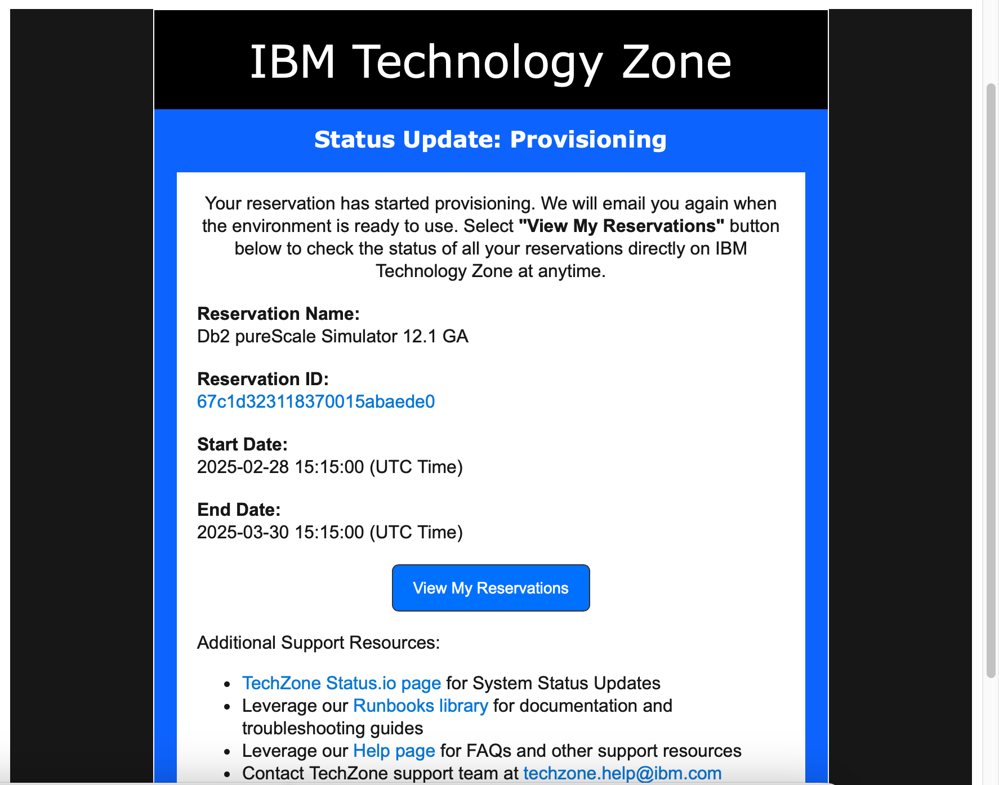

Eventually you will receive an email confirming that the system is ready to be used. Note that this can take a number of hours depending on the load on the TechZone servers.

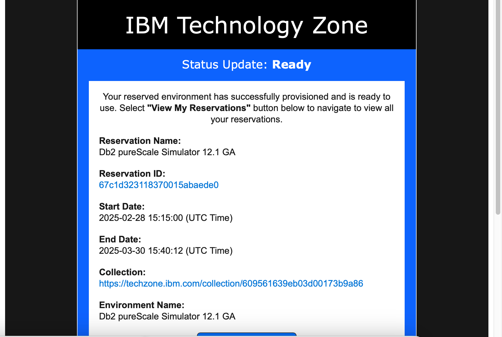

You may also get a message telling you that the system provisioning has Failed.

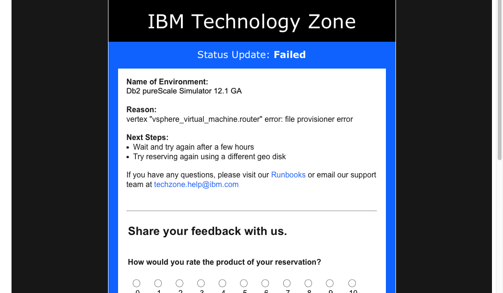

Ignore the reason field since it is usually related to an environment failure caused by lack of resources. Check the status of TechZone first (<a href="https://techzone.status.io" target="_blank">https://techzone.status.io</a>). If the systems appear to be okay, try requesting another image or using a different server location if possible. Contact TechZone support if you are having difficulties provisioning a system.

Once you have confirmation that the system is up and running, click on the View My Reservations button to access your environment.

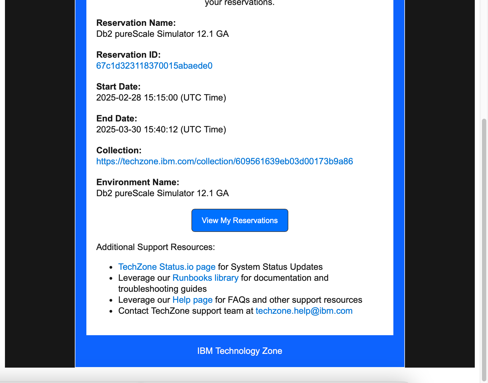

At this point you can continue on the section on [Accessing the System](ps-getting-started.md).