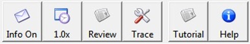
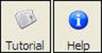
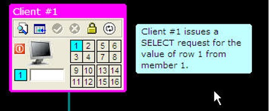
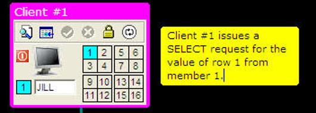
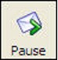
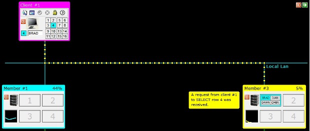
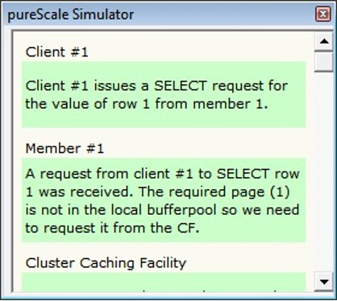
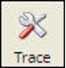
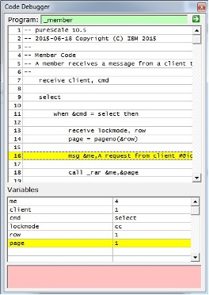

# Options

There are a variety of options that are available to the user to control the speed of animation and the length that messages are displayed. The buttons on the far-right side of the simulator are: 

* Message (Info) display
* Animation speed
* Session Review
* Tracing (Advanced)
* Tutorial
* Help 

 

## Tutorial and Help
The two buttons on the far-right side of the toolbar are used to guide you using the simulator. 

 

The TUTORIAL button will run a script taking you through some of the features that are found in the simulator, while the HELP button displays the full help information (this file). 

## Message Display
The Message (INFO) button is used to control the display of informational messages on the screen. 

 

The default value for informational messages is on. This means that the simulator will display messages as it runs and wait 1.5 seconds before continuing. 
 
  

These messages are usually placed beside one of the objects on the screen, such as clients, members, CF, or the file system. If you want to skip the message, you can click anywhere on the black background or the green sidebar that displays on the far right-hand side of the display while the simulation is running. 

  

If you click on the message itself, the background color of the message will turn yellow. 

 

When the message is yellow, the system will pause until you click on the message again, the black background, or the green arrow on the sidebar. 

Clicking on the INFO button will change its status to OFF. 

 

When messages are off, no informational messages will be shown. Your simulations will run fast, but you won't know what is going on! However, there are situations where you may be debugging or testing a configuration and you want to skip the messages that are being shown. See the session review button for details on how to review the messages you may have missed.

If you press the INFO button one more time it will change to a status of PAUSE. 

 

When the messages are in PAUSE status, every message will pause waiting for you to click on the message again, the black background or the arrow on the sidebar. 
If you click the INFO button one more time it will cycle back to messages being ON. 

## Animation Speed
When the simulation runs, the messages that are sent between clients, members, database, and the CF are animated using a series of dots. For example, the following image shows a message being sent between a client and a member. 

 

On average, these dots use between 1 to 2 seconds to reach their destination depending on distance (Note! In a real pureScale system, one of these communication requests takes about 15 microseconds!). You have the option of speeding up the animation and the length of time a message is displayed by clicking on this button. The values of the animation speed can be: 

* 1.0x - The default speed of 1-2 seconds depending on distance 
* 1.5x - A 50% increase in speed 
* 2.0x - Twice as fast 
* 4.0x - Four times as fast 
* Off 

If the animation speed is set to a numeric value (1.0, 1.5, 2.0, 4.0), the messages will continue to be displayed, but the pause time (for INFO ON) will be reduced. So instead of the default 1.5 seconds for a message to display, a 2.0x setting will make the message stay on the screen for only .75 seconds. You have the option of clicking on a message to pause it for further reading or use the PAUSE setting for messages. 

The final value (OFF) will draw all the dots immediately from the source to the destination without individually turning them on and off. This mode speeds up the drawing of the communication lines, but it does not speed up the messages. The messages will continue to pause for 1.5 seconds before continuing. This mode is a compromise if you want to speed up the simulation but still have time to read the messages. 

You can change the default values that the program uses for the message delay, message format, and the animation speed by modifying the _options.psc file found in the `system` directory. To change the amount of time that a message pauses before continuing, you would change the following line to include the delay time. In this example, the pause time is set to 3.5 seconds.

```json
option message,3.5
```

## Session Review
All the actions that take place during a session are recorded. You may decide to run the simulator with the messages turned off or with very fast animation. At any point in time, you can click on the review button to display the actions and messages that were displayed during the running of the simulator.

 
 
The program will display the actions and messages in a separate window. 

 

The system will continue to record the steps during your session unless you press the reset button. The reset button will clear the contents of the recording buffer.
 
## Tracing (Advanced)
The pureScale simulator is built upon several scripts that run in the background. If an error occurs, the trace window will appear and describe what went wrong. If you do encounter this, please let us know so we can figure out what the problem is. If you are interested in what the scripts are doing, click on the TRACE button. 

 

The following image is a sample trace window that would get generated when you start a SELECT statement from a client. 

 

The top of the trace window will show what statement is currently being executed while the bottom half will show the status of variables within the procedure. The trace window will update as the simulation runs. If your INFO setting is set to PAUSE, you will end up single stepping through the code. You must click on the black background or the green arrow at the top corner of the trace window to continue to the next step.
 
If the INFO setting is ON, the code will run at the rate of statement every 1.5 seconds. Setting the animation button to 2x or 4x may make it more bearable to watch the code running! 
This trace window is usually reserved for debugging scripts, so you shouldn't have to use this for running your simulations unless you are curious about what is happening "under the covers". 

Pressing the TRACE button again will remove the trace window from the screen.