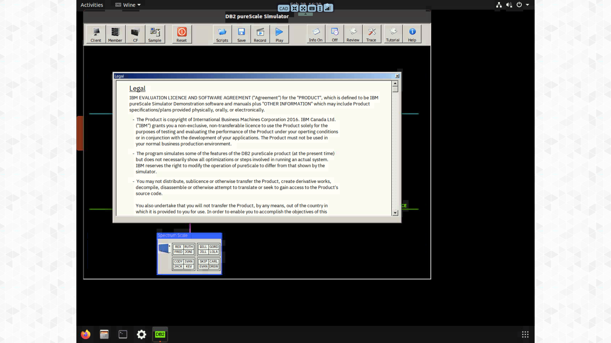
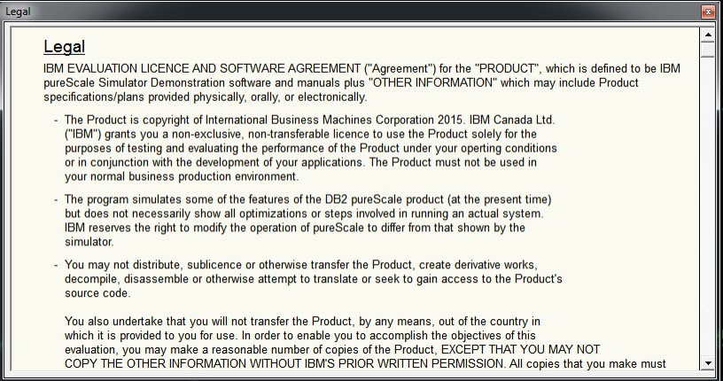
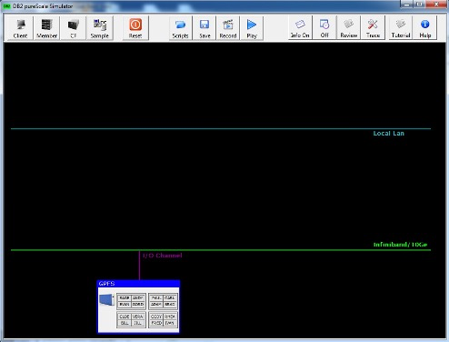
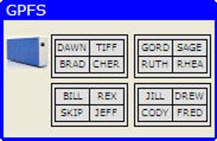

# Starting the Simulator

After you access the virtual machine console, you will see two desktop icons that will reset the screen for optimal display, and start the pureScale simulator program. 

!!! abstract "Start the pureScale Demo"

    If you haven't already done so, double-click on the pureScale icon on the desktop to start the simulator.

When the program first starts, it will display a legal disclaimer, which can be read and then dismissed by closing the window by pressing the [x] at the top right corner.

Once you've closed the legal disclaimer you will be presented with the following screen: 

The top row of the pureScale simulator contains several buttons that control the behavior of the system. The buttons can be divided into three groups: 

* pureScale objects for building a system to simulate 
* Record and playback buttons for running pre-configured systems 
* Options for setting the behavior of the simulator 

Below the screen you will see the network (Ethernet) for connecting clients to members, a 10Ge channel for connecting the Db2 members to the pureScale Cluster Caching Facility, and an I/O channel to the file system. Note that the file system does not run over 10Ge. The I/O system was placed off the 10Ge channel to reduce the number of connections required in the simulator.
 
By default, an empty system is shown whenever the simulator starts. A file system is already created by the simulator and will contain some random names in 16 slots or rows in the table. 
The file system used by Db2 is IBM® Spectrum Scale. IBM® Spectrum Scale is a high-performance enterprise file management that provides online storage management, scalable access, and integrated information lifecycle management tools capable of managing petabytes of data and billions of files. 

The IBM® Spectrum Scale file system is shown the bottom left-hand corner of the display connect via an I/O channel to the 10Ge network. Note that 10Ge is not used for the actual I/O but is merely used for simulating the I/O channel. 

 You can customize the values that are shown in the file system by editing the `_gpfs.cf` file found in the `system` directory. For more details on how this is done, please refer to the section on IBM® Spectrum Scale (GPFS). 